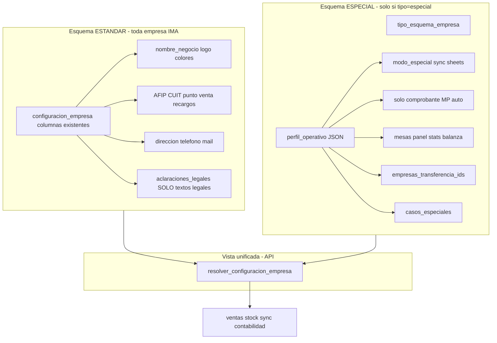

# Plan: Dos esquemas (estándar vs especial) por empresa

## Prioridad acordada

1. **Separar** configuración universal (esquema estándar) de reglas particulares (esquema especial).
2. **Estructura primero**, casos después.
3. Poder **migrar empresas** entre esquemas más adelante sin reescribir código ni perder datos estándar.

---

## Dos capas de configuración (separación explícita)



### Qué va en cada esquema

| Esquema estándar (`ConfiguracionEmpresa`) | Esquema especial (`perfil_operativo`) |
|-------------------------------------------|---------------------------------------|
| Nombre legal/fantasia, logo, color | `modo_especial`, sync Google Sheets |
| CUIT, condición IVA, punto venta AFIP | `caja_solo_comprobante`, remito/presupuesto |
| Recargos transferencia/banco | `factura_auto_mercado_pago` |
| Dirección, teléfono, mail, links | `panel_estadisticas_caja` |
| `formato_comprobante_predeterminado` | `mesas_habilitado`, descuentos cajero |
| `limite_consumidor_final` | Balanza auto agregar/facturar |
| Textos legales de tickets (sin flags) | `empresas_transferencia_ids` |
| `link_google_sheets` (URL del sheet) | `casos_especiales` (edge cases) |
| **No** flags operativos mezclados | `plantilla_origen` (auditoría) |

**Regla de oro**: si afecta *cómo opera* el negocio (caja, stock, sync, permisos) → esquema especial. Si afecta *datos del negocio* (fiscal, marca, contacto) → esquema estándar.

### Columna discriminadora: `tipo_esquema_empresa`

```python
class TipoEsquemaEmpresa(str, Enum):
    ESTANDAR = "estandar"   # perfil_operativo ignorado; defaults estándar IMA
    ESPECIAL = "especial"   # perfil_operativo activo; personalización completa
```

- Empresa nueva por defecto: `estandar`.
- La Esquina, FULL24, de-campo, La Esquina 2 (35–38): seed como `especial` con plantilla `modo_especial_pos`.
- El resolver **siempre** devuelve una vista unificada; si `estandar`, aplica `PLANTILLA_ESTANDAR` sin leer overrides del JSON (o JSON vacío).

---

## Plantillas predefinidas (para migrar sin armar flag por flag)

Archivo [`back/gestion/plantillas_perfil.py`](back/gestion/plantillas_perfil.py):

| Plantilla ID | Uso | Perfil base |
|--------------|-----|-------------|
| `retail_estandar` | Supermercado IMA clásico | sync Sheets, factura si AFIP, mesas off, panel off |
| `modo_especial_pos` | La Esquina / FULL24 | modo_especial, solo comprobante, panel stats, transferencias configurables |
| `modo_especial_demo` | Demos 37/38 | igual que pos pero grupo transferencia demo |

```python
PLANTILLAS: dict[str, PerfilOperativoEmpresa] = {
    "retail_estandar": PerfilOperativoEmpresa(...),
    "modo_especial_pos": PerfilOperativoEmpresa(
        modo_especial=True,
        sincronizar_google_sheets=False,
        caja_solo_comprobante=True,
        panel_estadisticas_caja=True,
        ...
    ),
}
```

Soporte al migrar elige plantilla → el sistema copia el perfil base y permite ajustar después.

---

## Migración entre esquemas (revisable después)

### Especial → Estándar

Función `migrar_empresa_a_esquema_estandar(db, id_empresa)`:

1. Guardar snapshot del `perfil_operativo` actual en `perfil_operativo_archivado` (JSON histórico, solo auditoría).
2. Setear `tipo_esquema_empresa = estandar`.
3. Limpiar `perfil_operativo` → `{}` (o null).
4. Sincronizar `modo_especial_habilitado = False`.
5. **No tocar** columnas estándar (CUIT, logo, AFIP, recargos).
6. Registrar en log: quién migró, cuándo, plantilla anterior.

Efecto: la empresa vuelve a comportamiento IMA clásico; datos fiscales y de marca intactos.

### Estándar → Especial

Función `migrar_empresa_a_esquema_especial(db, id_empresa, plantilla_id)`:

1. Setear `tipo_esquema_empresa = especial`.
2. Copiar `PLANTILLAS[plantilla_id]` → `perfil_operativo`.
3. Sincronizar `modo_especial_habilitado` con `perfil.modo_especial`.
4. Soporte puede editar flags puntuales después del PATCH.

### Especial → Especial (cambio de plantilla)

`aplicar_plantilla_perfil(db, id, plantilla_id, merge=False)`:

- `merge=False`: reemplaza perfil completo (con confirmación UI).
- `merge=True`: solo sobrescribe campos que la plantilla define; conserva `casos_especiales` y transferencias custom.

### Endpoint Soporte

- `POST /empresas/admin/{id}/migrar-esquema`
  

```json
  { "tipo_esquema": "especial", "plantilla_id": "modo_especial_pos" }
  

```
- `GET /empresas/admin/plantillas-perfil` → lista plantillas con descripción humana.

### UI: preview antes de migrar

En panel Empresas, al cambiar esquema:

- Mostrar diff: qué flags cambian (ej. "sync Sheets: off → on").
- Checkbox "Entiendo, migrar configuración operativa".
- Datos estándar (CUIT, logo) **nunca** se muestran como afectados.

---

## Resolver unificado (única puerta de lectura)

Renombrar conceptualmente a `resolver_configuracion_empresa` que combina ambos esquemas:

```python
def resolver_configuracion_empresa(db, id_empresa) -> ConfiguracionEmpresaResuelta:
    config = obtener_configuracion_empresa(db, id_empresa)
    tipo = config.tipo_esquema_empresa or TipoEsquemaEmpresa.ESTANDAR

    if tipo == TipoEsquemaEmpresa.ESTANDAR:
        perfil = PLANTILLAS["retail_estandar"].model_copy()
    else:
        perfil = cargar_perfil_raw(config) or PLANTILLAS["modo_especial_pos"]
        perfil = aplicar_fallback_legacy(config, perfil)  # transición

    perfil = aplicar_computados(db, config, perfil)  # AFIP, caja_puede_facturar
    return ConfiguracionEmpresaResuelta(
        tipo_esquema=tipo,
        estandar=ConfiguracionEstandarResponse.model_validate(config),
        perfil_operativo=perfil,
    )
```

Los consumidores **nunca** miran `tipo_esquema` directamente salvo UI Soporte; leen flags del perfil resuelto.

---

## Schemas de archivos (separados en código)

| Archivo | Contenido |
|---------|-----------|
| [`back/schemas/configuracion_schemas.py`](back/schemas/configuracion_schemas.py) | Esquema estándar (existente, sin flags operativos nuevos) |
| [`back/schemas/perfil_operativo_schemas.py`](back/schemas/perfil_operativo_schemas.py) | **Solo** esquema especial |
| [`back/schemas/configuracion_resuelta_schemas.py`](back/schemas/configuracion_resuelta_schemas.py) | Vista API: estándar + perfil + computados |
| [`front/src/types/configuracionEstandar.ts`](front/src/types/configuracionEstandar.ts) | Tipos estándar |
| [`front/src/types/perfilOperativo.ts`](front/src/types/perfilOperativo.ts) | Tipos especial |

```python
# perfil_operativo_schemas.py
class PerfilOperativoEmpresa(BaseModel):
    version: int = 1
    plantilla_origen: Optional[str] = None  # auditoría migración
    modo_especial: bool = False
    sincronizar_google_sheets: bool = True
    caja_solo_comprobante: bool = False
    caja_permitir_remito_presupuesto: bool = False
    factura_auto_mercado_pago: bool = False
    panel_estadisticas_caja: bool = False
    mesas_habilitado: bool = False
    bloquear_descuentos_cajero: bool = False
    balanza_auto_agregar: bool = False
    balanza_auto_facturar: bool = False
    empresas_transferencia_ids: list[int] = Field(default_factory=list)
    casos_especiales: dict[str, str | int | bool] = Field(default_factory=dict)

class PerfilOperativoResuelto(PerfilOperativoEmpresa):
    facturacion_afip_habilitada: bool = False
    caja_puede_facturar: bool = False
    caja_puede_remito_presupuesto: bool = False
```

### Migración DB (Alembic)

Nuevas columnas en `configuracion_empresa`:

- `tipo_esquema_empresa` VARCHAR, default `'estandar'`, not null
- `perfil_operativo` JSON, default `{}`
- `perfil_operativo_archivado` JSON nullable (historial al migrar a estándar)

Seed 35–38: `tipo_esquema='especial'`, plantilla `modo_especial_pos`, transferencias según grupo actual prod/demo.

Deprecación progresiva: `modo_especial_habilitado` columna → sincronizada desde perfil; eventualmente solo lectura legacy.

---

## UI Soporte — dos formularios separados

En [`empresas/page.tsx`](front/src/app/dashboard/configuracion/empresas/page.tsx):

1. **Configuración estándar** (ya existe `ConfiguracionForm`): fiscal, marca, contacto, AFIP tools.
2. **Esquema y perfil operativo** (nuevo `PerfilOperativoForm`):
   - Selector: Estándar | Especial
   - Si Especial: selector plantilla + switches por dominio
   - Botón "Migrar esquema" con preview diff
   - Badge: `tipo_esquema` actual + `plantilla_origen`
3. **Textos legales** (`ConfiguracionLegalesForm`): sin mezclar flags operativos.

---

## Principios de diseño (actualizados)

1. **Dos esquemas, un resolver**: estándar y especial viven en lugares distintos; el resolver los fusiona.
2. **Migración reversible en datos**: archivar perfil al pasar a estándar permite volver a especial con snapshot.
3. **Plantillas > copiar empresa**: nueva empresa especial = elegir plantilla, no clonar ID 35.
4. **Front tonto**: `usePerfilEmpresa()` consume vista resuelta; no distingue esquemas en ventas/caja.
5. **Legacy acotado**: `aclaraciones_legales` operativas solo como fallback en resolver hasta Fase 5.

---

## Fases

### Fase 0 — Dos esquemas + resolver + plantillas (PRIORITARIA)

- Schemas separados estándar / especial / resuelto
- Migración Alembic: `tipo_esquema_empresa`, `perfil_operativo`, `perfil_operativo_archivado`
- `plantillas_perfil.py` + `perfil_operativo_manager.py`
- `resolver_configuracion_empresa` + `migrar_a_estandar` / `migrar_a_especial`
- Endpoints Soporte + seed 35–38
- Tests: empresa estándar usa plantilla retail; empresa especial usa overrides; migración especial→estándar no borra CUIT

### Fase 1 — Contrato API + hook front

- `GET /configuracion/mi-empresa` devuelve `tipo_esquema` + `perfil_operativo_resuelto` + bloque estándar
- `usePerfilEmpresa` + tipos TS separados

### Fase 2 — Adaptadores backend

- Delegar a resolver; eliminar frozensets `EMPRESAS_*`

### Fase 3 — UI Soporte

- Formulario dual (estándar / especial) + migración con preview

### Fase 4 — Consumidores front

- Eliminar hardcode; leer perfil resuelto

### Fase 5 — Casos + limpieza migración datos

- Lote, MP, AFIP La Esquina
- Script: mover keys operativas de `aclaraciones_legales` → perfil
- Test migración: simular FULL24 especial→estándar y viceversa

---

## Riesgos y mitigaciones

| Riesgo | Mitigación |
|--------|------------|
| Mezclar otra vez flags en estándar | Lint/review: prohibido agregar booleans operativos a `ConfiguracionEmpresa` |
| Migrar y perder perfil custom | `perfil_operativo_archivado` + preview diff en UI |
| Empresa estándar con JSON basura | Resolver ignora `perfil_operativo` si `tipo=estandar` |
| Dos fuentes modo_especial | Sync bidireccional columna ↔ perfil hasta deprecar columna |

---

## Criterio de éxito

- Toda empresa IMA tiene esquema **estándar** claro (fiscal, marca, contacto).
- Empresas particulares usan esquema **especial** con perfil y plantilla, sin IDs en código.
- Soporte puede **migrar** una empresa entre esquemas con preview, sin tocar datos estándar.
- Agregar un caso nuevo = plantilla o flag en perfil especial, no deploy por empresa.

---

## Fuera de alcance (por ahora)

- Duplicar perfil entre empresas (botón "copiar de empresa X") — después de plantillas.
- Recargos/formato en `facturacionStore` localStorage — sigue global.
- Eliminar columna `modo_especial_habilitado` — fase posterior a Fase 5.
